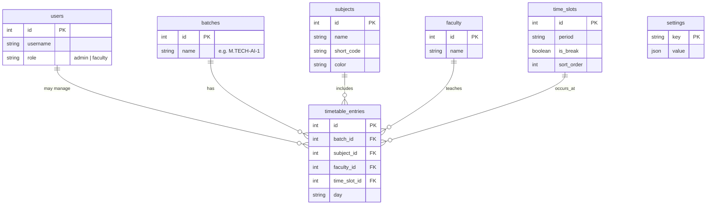
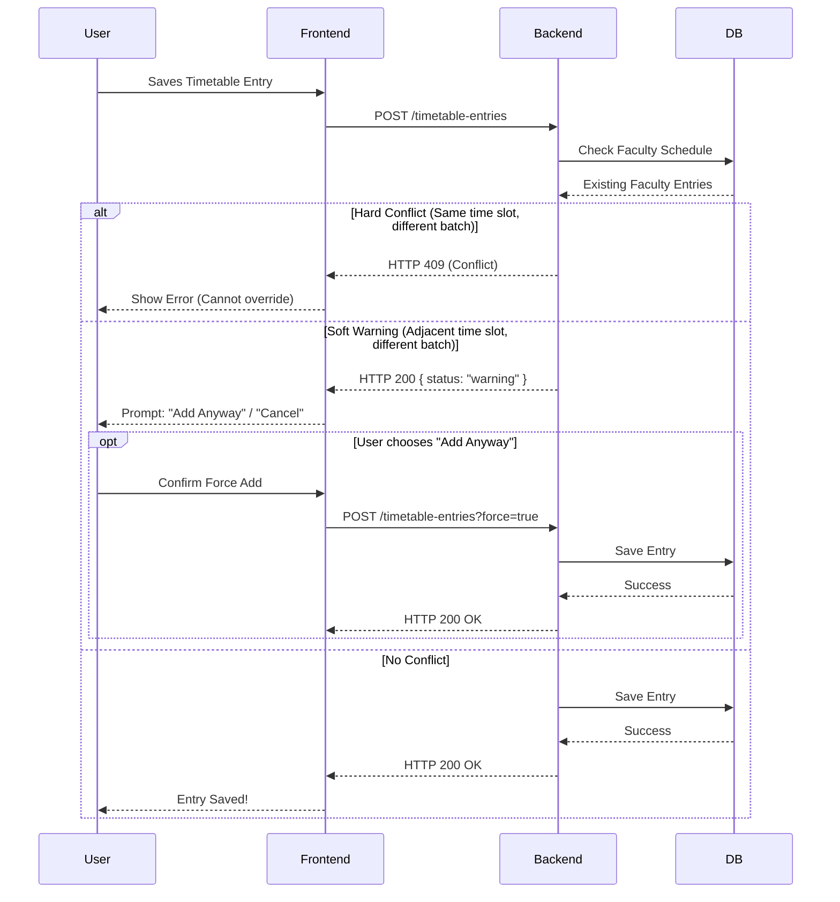

# NitaTime Architecture

This document provides a high-level overview of the NitaTime college timetable management system architecture.

## System Architecture

NitaTime is built using a modern, unified tech stack. In production, it is deployed as a single Docker container where the FastAPI backend serves both the API and the compiled React static files.

```mermaid
flowchart TD
    %% Define Styles
    classDef client fill:#e3f2fd,stroke:#1e88e5,stroke-width:2px;
    classDef docker fill:#f3e5f5,stroke:#8e24aa,stroke-width:2px,stroke-dasharray: 5 5;
    classDef frontend fill:#fff3e0,stroke:#fb8c00,stroke-width:2px;
    classDef backend fill:#e8f5e9,stroke:#43a047,stroke-width:2px;
    classDef database fill:#ffebee,stroke:#e53935,stroke-width:2px;

    %% Client Layer
    Client[Browser / User]:::client

    %% Docker Container (Unified Deployment)
    subgraph Container [Unified Docker Container]
        direction TB
        Static[React + Vite Frontend\n(Served as Static Files)]:::frontend
        FastAPI[FastAPI Backend]:::backend
        
        Static -.->|API Calls\nJSON over HTTP| FastAPI
    end
    class Container docker

    %% Database Layer
    DB[(Database\nSQLite / Turso)]:::database

    %% Connections
    Client -->|HTTP Request| Static
    Client -->|REST API Requests| FastAPI
    FastAPI <-->|SQLAlchemy ORM| DB
```

## Data Model Architecture

The database follows a relational model centered around timetable entries.



## Conflict Detection Flow

The system employs conflict resolution logic when assigning a faculty to a time slot.


